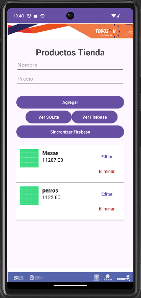

# Aplicación móvil pizzería Unal reto 1

Esta aplicación móvil avanzada proporciona un conjunto completo de funcionalidades de seguridad para garantizar la autenticación, autorización y protección de datos de los usuarios. Con una interfaz intuitiva y características sólidas, esta aplicación ofrece una experiencia segura y confiable para los usuarios.

## Características Principales

- **Autenticación Segura**: Permite a los usuarios iniciar sesión de forma segura utilizando su correo electrónico y contraseña, así como mediante el inicio de sesión con Google.
- **Autorización Flexible**: Proporciona una autorización basada en roles, permitiendo a los usuarios acceder a diferentes recursos según su rol asignado.
- **Protección de Datos**: Ofrece información detallada sobre la protección de datos y la privacidad, destacando las mejores prácticas y políticas de seguridad.

## Capturas de Pantalla

1.  - Vista principal de la aplicación.
2.  - Pantalla de inicio de sesión
3.  - Pantalla de sesión con Google.
4.  - Confirmación visual después de un inicio de sesión exitoso.
5.  - Pantalla de autorización con selección de roles.
6.  - Vista de autorización para un usuario con rol de administrador.
7.  - Vista de autorización para un usuario con rol de usuario.
8.  - Vista de autorización para un usuario invitado.
9.  - Información sobre protección de datos y privacidad.

## Requisitos

- Dispositivo Android con versión 5.0 (Lollipop) o superior.
- Conexión a Internet para algunas funciones.

## Instalación

1. Descarga el archivo APK desde [aquí](#).
2. Abre el archivo APK en tu dispositivo Android.
3. Sigue las instrucciones de instalación en pantalla.

## Contribución

Contribuciones son bienvenidas. Para cambios importantes, por favor, abre un issue primero para discutir lo que te gustaría cambiar.

## Licencia
Universidad Nacional de Colombia
Diplomado en desarrollo de aplicaciones móviles
[MIT](LICENSE)
